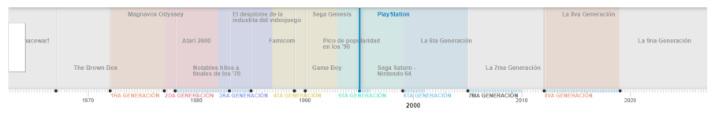
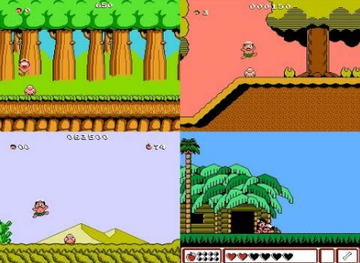
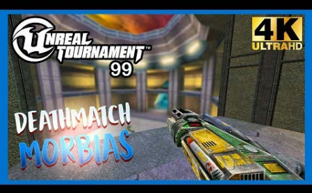
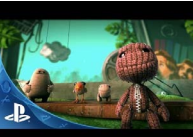
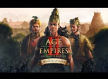
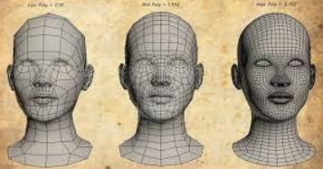
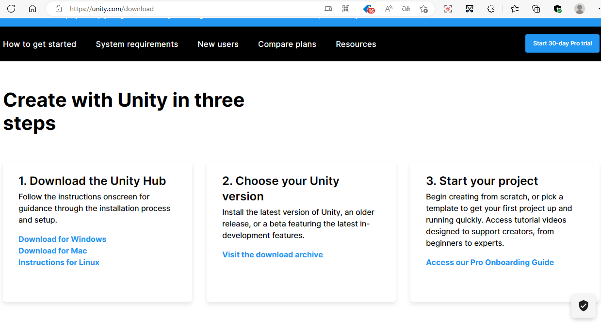
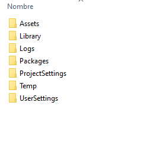
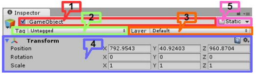

Creación de videjuegos con Unity
------------------

Este repo contiene mis apuntes y ejercicios para el aprendizaje de unity

## Índice
- [Intro](#t1) 
- [2D, 3D y 2,5D](#t2) 
    - [2D](#t2-2) 
    - [3D](#t2-3) 
    - [2.5D](#t2-4) 
- [Polígonos](#t3) 
- [Géneros](#t4)
- [Motores gráficos](#t5) 
- [Motores de juego](#t6) 
    - [Unreal Engine](#t6-2)
    - [Unity](#t6-3)
    - [GameMaker Studio](#t6-4)
    - [Godot](#t6-5)
    - [CryEngine](#t6-6)
    - [Amazon Lumberyard](#t6-7)
- [Instalación de UNITY](#t7)
- [Estructura de proyecto](#t8)
- [Game Assets](#t9)
    - [Level Art](#t9-2)
    - [Entorno](#t9-3)
    - [Diseño](#t9-4)
    - [Props](#t9-5)
    - [Objetos destructibles](#t9-6)
    - [Sprites](#t9-7)
    - [Partículas](#t9-8)
    - [Materiales, Shaders y Texturas](#t9-9)
    - [GUI (Graphical User Interface)](#t9-10)
    - [Game Object](#t9-11)
    - [Prefab](#t9-11)
- [Custom Asset](#t10)
- [Documento de Diseño (GDD)](#t11)
    - [CONCEPTO](#t11-2)
    - [HISTORIAL DE VERSIONES](#t11-3)
    - [VISIÓN GENERAL DEL JUEGO](#t11-4)
    - [MECÁNICA DEL JUEGO](#t11-5)
    - [ESTADO DEL JUEGO](#t11-6)
    - [INTERFACES](#t11-7)

-------------------------------

## Intro 
Timeline de la historia de los videojuegos

### 2D, 3D y 2,5D 
Al momento de realizar un videojuego, una de las decisiones más importantes a tomar al principio del desarrollo del  mismo es el apartado gráfico. El eterno dilema de si el juego se va a realizar en 2D, 3D o incluso 2.5D. 
#### 2D 
Un juego en 2D es aquel que tiene las siguientes 
características:

● Gráficos con apariencia plana
● Movimiento solo en dos dimensiones.

Se encuentra dentro de esta clasificación la 
mayoría de los videojuegos de antaño como es el 
caso de Super Metroid, Street Fighter, Mario Bros, 
Adventure Island, Mortal Kombat, Tetris y un 
largo etc.

#### 3D 

Por otro lado, tenemos los juegos en 3D que 
usan:
● Gráficos con modelos en tres 
dimensiones
● Al mismo tiempo, permiten la libertad de 
movimiento en el espacio y no solo en un 
plano. 

La lista de videojuegos de este estilo es más larga, 
ya que prácticamente casi todos los juegos 
modernos son en 3D y algunos clásicos también. 
Mario Bros 64 y posteriores, Unreal Tournament, 
Need for Speed, Fable, Devil May Cry, God of War, 
Prince of Persia, Saint Seiya, Resident Evil, Soul 
Calibur, Mass Effect, World of Warcraft y un más 
Fuente: RC_56 Gameplays...

#### 2.5D 
Como no existe media dimensión, entonces ahora entra la duda sobre que es un videojuego 2.5D.

Hay dos estilos de videojuegos en 2.5D:

* Gráficas en 2D que por ciertas técnicas: perspectiva, sombras y demás, aparentan ser 3D cuando en realidad no lo son.

* Videojuegos con gráficos 3D cuya jugabilidad está restringida a un plano bidimensional.

### Polígonos 
En los primeros años de vida de los videojuegos las limitaciones tecnológicas impedían expandir la  creatividad de los desarrolladores, restringiéndoles a las dos dimensiones de una pantalla con pequeñas  figuras de escasos colores.
Con el paso de los años, los avances en hardware fueron abriendo caminos que permitieron mejoras  sustanciales en el apartado gráfico. 

● Con Smooth scrolling se logró acceder a  mayor terreno de juego 
● El Sprite scaling es una forma de mapeo de texturas que permite simular cierta sensación  de tres dimensiones.
● Pero los desarrolladores necesitaban un  recurso superior que les permitiese ingresar al  verdadero mundo del 3D, por lo que finalmente llegamos a la era de los Polígonos.

Un polígono es una figura en dos dimensiones compuesta por líneas rectas y luego “rellenada” con una determinada textura o color. Los objetos tridimensionales son ni más ni menos que un conjunto de polígonos formando una figura con profundidad. Estos objetos se clasifican en “low-poly”, “med-poly” y “high-poly”. Básicamente, a más polígonos, mayor será el detalle del objeto. A esto se lo denomina LOD (Level of Detail), es decir, nivel de detalle, y a más LOD, más recursos en hardware son necesarios.

Los juegos de los 90 aún eran limitados en cuanto al LOD. Se aplicaban entre 500 y 700 polígonos para figuras como Mario, Crash y los personajes de Tekken 3. 
Esto fue cambiando con el tiempo. Los personajes del GTA: San Andreas y Jak & Daxter usaban de 2000 a 4000 polígonos. Con el paso de los años los números se fueron multiplicando y en la actualidad es normal hablar de entre 70 y 150.000 polígonos para un simple protagonista de videojuego.

### Géneros 

* Acción
- Lucha
- Beat ‘em up
- Hack and Slash
- Arcade
- Plataformas
- Shooters
- First Person Shooter (FPS)
- Third Person Shooter (TPS)
- Shoot ‘em up o disparo a progresión
- Point and Shoot
- Shooter on rails

* Aventura
- Point and Click
- Visual novels
- Películas interactivas
- Survival Horror

* Estrategia
- Real Time Strategy (RTS)
- 4x game
- Real Time Tactics
- Multiplayer Online Battle Arena (MOBA)
- Turn Based Strategy (TBS)
- Turn Based Tactics (TBT)
- Tower Defense
- Artillery Game
- Wargame y Grand Strategy games

* ROLE PLAYING GAMES (RPG)
- Juegos de rol
- RPG de acción
- Massive Multiplayer Online Role Playing Game (MMORPG)
- Tactical RPG
- Sandbox RPG
- Fantasía

* Simulación
- construcción y manejo de recursos
- simulación de vida
- simulación de vehículos
- Serius games

* Deportes
- Carreras 
    - Arcade
    - Simulación
- A base de lucha
- competitivos

* Otros
- Massive Multiplayer Online (MMO)
- Música
- Para fiestas
- Lógica
- Mesa y cartas
- Educativos

## Motores gráficos 
Un motor gráfico es un software usado por aplicaciones y programas para dibujar gráficos en la pantalla de nuestro ordenador, smartphone o tablet.
Más concretamente, se define como motor gráfico al framework de software diseñado para crear y desarrollar videojuegos.

Todo motor gráfico ha de ofrecer al programador una funcionalidad básica, proporcionando normalmente:
● Un motor de renderizado (“render”) para gráficos 2D y 3D. 
● Un motor de interacciones físicas, que detecte la colisión física de objetos y la respuesta a dicha colisión.
● Sonidos y música.
● Animación.
● Inteligencia artificial. 
● Comunicación con la red para juegos multijugador.
● Posibilidad de ejecución en hilos. 
● Gestión de memoria o soporte para localización (traducción de los textos y audios del juego según idioma).

## Motores de juegos 
### Unreal Engine 
Es ampliamente considerado uno de los mejores game engine en general, principalmente debido a 
los gráficos que puede ofrecer y la amplia gama de opciones de personalización disponibles.

Algunos de los títulos más populares que se han construido en Unreal Engine son: Fortnite, la serie Borderlands, Rocket League, la serie Gears of War, Bioshock, etc.

Sin embargo, Unreal Engine no es ideal para todos los desarrolladores de juegos. En primer lugar, no es tan fácil de aprender como algunas de las otras 
opciones de game engines que existen y, si no está  buscando construir juegos 3D robustos, 
probablemente sea mejor comenzar con un motor más simple(especialmente si estamos buscando 
construir juegos móviles.)

### Unity 
Si bien Unity y Unreal Engine a menudo se consideran los dos motores principales de juegos, ambos motores  tienen diferentes propósitos. Unreal Engine es el más adecuado para juegos más robustos, Unity es más versátil y puede ser una mejor opción para los desarrolladores que buscan crear juegos móviles, juegos 2D o juegos 3D story-driven.

Para tener una idea de cuán versátil es Unity, aquí hay una muestra de algunos de los mejores juegos hechos con Unity: City: Skylines, Kerbal Space Program, 
Hearthstone, Escape from Tarkov, la serie The Room, etc.

Unity ofrece toneladas de recursos de aprendizaje gratuitos a través de Unity Learn, y el motor es lo suficientemente intuitivo para que los principiantes puedan comenzar con una curva de aprendizaje menos pronunciada.

### GameMaker Studio 
Resulta fácil de aprender y no requiere experiencia previa en programación. En lugar de tener que escribir scripts o líneas de código, GameMaker le permite "arrastrar y soltar".Por supuesto, la naturaleza fácil de GameMaker Studio lo limita en el tipo de juegos que puedes hacer. GameMaker admite el desarrollo de juegos en 3D, pero realmente es más adecuado para construir juegos en 2D.

Algunos ejemplos de creaciones con GameMaker Studio son: Spelunky, 
Undertale, Hyper Light Drifter y Hotline Miami.

Sin embargo, a medida que el desarrollo de juegos independientes se ha vuelto más popular y debido a que hay un gran mercado para los juegos de estilo RPG 2D, GameMaker es un motor que vale la pena considerar para ciertos desarrolladores.

### Godot 
Otra opción si se desea construir juegos de estilo 2D  o juegos 3D simples es Godot. Godot no ha existido tanto tiempo como algunos de los otros motores en esta lista y realmente no ha habido ningún juego súper exitoso hecho con el 
motor.

Este motor es:
● Código abierto
● Completamente gratuito 
● Liviano 
● Tiene una comunidad sólida detrás 
● Ofrece una tonelada de herramientas para desarrolladores 
● Es compatible con múltiples plataformas.

### CryEngine 
CryEngine es un motor de juego creado por la empresa Crytek, originalmente un motor de demostración para la empresa Nvidia, que al demostrar un gran potencial se implementa por primera vez en el videojuego Far Cry, desarrollado por la misma empresa creadora del motor.

### Amazon Lumberyard 

Amazon compró el código fuente de CryEngine y desarrolló su propio motor de juego: Amazon Lumberyard. 

En otras palabras, Lumberyard tiene el potencial de alta gama que tienen motores como Unreal 
Engine 4 y CryEngine, pero con el respaldo de una gran empresa conocida por la innovación en una 
variedad de sectores.

Aun así, Lumberyard sufre algunas de las mismas caídas que sufre CryEngine: falta de usuarios, no 
muchos recursos de aprendizaje y no es tan confiable como otros motores.

## Instalación de Unity 

Descarga en https://unity.com/download 

## Estructura de proyecto 
Las carpetas más importantes a la hora de compartir un proyecto son Assets, Packages y ProjectSettings.

● Assets va a tener en su interior los archivos que se crean y se usan en el juego.
● ProjectSettings va a tener la configuración de los sistemas de Unity que se usan en el juego.
● Si instalamos algún módulo o paquete para expandir la funcionalidad de Unity, estos 
estarán en la carpeta Packages.
● Dentro de Library estarán los archivos importados convertidos al formato que utiliza Unity

## Game Assets 
Casi todos los videojuegos son un paquete bastante complejo. Se debe desarrollar la historia, agregar música y sonido, y se deben diseñar e implementar los aspectos visuales del juego. 
Aparte de todo lo demás,desarrollar las visuales 
es un GRAN TRABAJO. Hay varios assets diferentes que los desarrolladores eligen para crear el paquete que ves cuando te sientas a jugar un juego en particular. 
Uno de los primeros pasos para desarrollar un juego que coincida con la idea que tienes en mente es determinar qué assets incluir y cómo los desarrollarás. 

Diseño 2D / 3D
● Personajes
● Objetos
● Ambientes
● Vehículos
● GUI

HUD
● Íconos
● Secuencias de comandos

AI
● Efectos especiales
● Redes
● Física

Audio
● Música de fondo
● Efectos de sonido

### Level Art 
Level Art es una parte muy importante del diseño del juego. 

Es fácil confundir la idea del arte de niveles con el medio ambiente, ya que parecen superponerse de alguna manera. Sin embargo, el arte de niveles es esencialmente el lugar donde se encuentran el arte y lajugabilidad.

Un artista de niveles trabajará con los otros artistas para determinar dónde se ubica cada 
uno de estos assets en relación con el entorno, asegurándose de que el motor físico del juego 
no se vea comprometido.

### Entorno 
Un entorno bien diseñado puede crear una experiencia de juego altamente inmersiva. 
Entornos simples y estáticos eran la norma hace mucho tiempo. Hoy, los entornos de juego son una extensión de los juegos mismos. Los juegos con entornos en constante cambio son muy atractivos y hacen que el jugador se sienta más como si realmente estuviera dentro del juego.

### Diseño 
El diseño de personajes es, por supuesto, muy importante. Sin embargo, un personaje no tiene 
que ser creado cuidadosamente para ser atractivo, incluso los personajes simples como los de la serie Super Mario Brothers son memorables y atractivos. 

La clave más importante es asegurarse de que este asset se ajuste al entorno y a los accesorios, objetos y otras cosas del mundo del juego.

### Props 
Las props son cosas que no tienen vida que mejoran o cambian el gameplay. 

Esto podría incluir elementos como un barril sobre el que salta el personaje, una bandera que el 
personaje toque al final de una carrera o las barreras que evitan que dos luchadores salgan de 
un ring de lucha libre. 

Estas son una parte tan importante del juego que no pueden pasarse por alto.

### Objetos destructibles 
Los objetos destructibles han sido una parte crítica de los juegos durante muchos años. 
Piensa incluso en lo que respecta a Donkey Kong. Había barriles que el personaje podía golpear con un martillo y explotar para reaccionar en la pantalla. 

Si bien los objetos destructibles de hoy en día son a veces más creativos, son básicamente lo mismo, ¡pero con más polígonos y mejor física!

### Sprites 
Inicialmente, un sprite era una imagen de mapa de  bits que era gestionada por un hardware 
especializado, independiente de la CPU de la máquina, usado generalmente para los protagonistas de los videojuegos u otros personajes, ya que permitía gestionarlos de manera independiente a los fondos.

Con el paso del tiempo el término sprite acabó por hacer referencia a cualquier imagen de mapa de 
bits presente en pantalla, generalmente refiriéndose a los personajes del juego.

En programación de videojuegos es la máscara o imagen de un objeto que tiene la capacidad de colisión.

### Partículas 
Las partículas son utilizadas para crear efectos. Estos elementos utilizan una cantidad definida de 
imágenes, y mediante código, éstas son producidas con diferentes reglas. 

Por ejemplo en una explosión, salen volando reproducciones de una misma imagen para hacer 
parecer que ésta es muy grande.
Otro ejemplo tradicional es cuando un personaje va corriendo muy rápido y deja una estela de imágenes de él, o si un hada deja chispas brillando en el aire. 
El fuego, el humo, la lluvia y muchos otros efectos son hechos de manera más eficiente utilizando partículas.

### Materiales, Shaders y Texturas 
Los materiales definen cómo se debe representar una superficie, incluyendo referencias a las texturas que usa, información de mosaico, matices de color y más. 
Las opciones disponibles para un material dependen del shader que esté utilizando el material.

Los shaders son pequeños scripts que contienen los cálculos matemáticos y algoritmos para calcular el Color de cada píxel renderizado, basado en la entrada de iluminación y la configuración del material.

Las texturas son imágenes de mapa de bits. Un material puede contener referencias a texturas, de modo que el sombreador del material pueda usar las texturas mientras calcula el color de la superficie de un objeto.
Además del Color básico (Albedo) de la superficie de un objeto, las texturas pueden representar muchos otros aspectos de la superficie de un material, como su reflectividad o rugosidad.

Un material especifica un shader específico para usar, y el shader utilizado determina qué opciones están disponibles en el material. Un shader especifica una o más variables de texturas que espera usar en el objeto, y el inspector de materiales en Unity permite asignar sus propios assets de texturas a estas variables de texturas.

### GUI (Graphical User Interface)
Todo lo que concierne a la interfaz del usuario que utiliza 
un conjunto de imágenes para representar la información y acciones disponibles.

● Menús
○ Principales (inicio, opciones, salir, etc)
○ Extras (mapas, páginas de estadísticas de 
personajes, menús de rpg)

● HUD (Heads Up Display, es una indicación de todo lo que el jugador necesita saber: la vida, el tiempo restante, cuánto tiene de municiones restantes de un arma, su energía o cualquier otro recurso que sea necesario conocer en cualquier momento)
● Mensajes (errores, muerte o game over, cambio de nivel,etc)

### GameObject 
Son uno de los elementos indispensables en el desarrollo de videojuegos con Unity, ya que representan cualquier objeto situado en la escena del juego.

Sus características básicas:
● Es posible desactivar un GameObject, afectando por igual a todos los elementos hijos de éste.
● El uso de un tag asignado al GameObject, permite vincular a varios objetos entre sí que 
implementen características similares (un ejemplo muy común son los tags «Player» o «Enemy», para identificar los personajes que maneja el usuario o los enemigos representados en el videojuego, respectivamente).
● Los componentes asignados a cada GameObject proporcionan su comportamiento y funcionalidad 
en la lógica del juego.

Todo GameObject estará formado por defecto por los siguientes elementos:

1. Nombre del GameObject en la escena (junto a un checkbox para habilitar o no este objeto en el juego).
2. Tag que permita identificar el objeto programáticamente, además de agrupar elementos que definen 
características similares.
3. Layer, que proporciona un desplegable donde se especifica la capa donde se representará el objeto.
4. Componente Transform, que describe la posición (coordenadas X, Y, Z), rotación (en grados alrededor del eje X, Y, Z) y escala (tamaño del objeto, que al definir valor 1, indica que es el tamaño original) del objeto en la escena.
5. Propiedad Static (checkbox), que permite especificar si un objeto se moverá o no a lo largo del escenario.

### Prefab 
Los prefabs son objetos reutilizables, y creados con una serie de características dentro de la vista proyecto, que serán instanciados en el videojuego cada vez que se estime oportuno y tantas veces como sea necesario. 

Ventajas:
● Es posible diferenciar qué objetos están conectados a un prefab desde la jerarquía de objetos (resaltados en color azul).
● Permite modificar los valores de un elemento del prefabinstanciado, no afectando al resto de instancias implementadas, y sin romper la conexión con el prefab creado en los recursos del 
proyecto.
● Si se modifican las propiedades del prefab creado, y este es instanciado en diferentes zonas de la escena, los cambios realizados afectarán a todas las instancias implementadas, sin necesidad de 
tener que modificar de manera individual cada instancia.

## Custom Asset 
Unity Asset Store es el hogar de una creciente biblioteca de assets gratuitos y comerciales creados por Unity Technologies y también por miembros de la comunidad. 

Se encuentra disponible una amplia variedad de assets, que abarcan desde texturas, modelos y animaciones hasta ejemplos completos de proyectos, tutoriales y extensiones del editor. 

Se puede acceder a los assets desde una simple interfaz integrada en el Editor de Unity que permite descargar e importar assets directamente en el Proyecto.

## Documento de Diseño (GDD) 
Empezaremos por el documento y «esqueleto» de un videojuego: El Documento de diseño o 
GDD.
El documento de diseño de un videojuego es el equivalente a «la Biblia» de una serie o programa 
de televisión. Este documento es la base para el futuro desarrollo del juego.
El GDD (game design document) no es un guión del juego, sino una síntesis de lo que va a ser (concepto, historia, género,número de plataformas, equipo de producción…)

CONCEPTO 
● Título: del juego, debe ser un nombre que capte la atención del jugador y del lector del documento. A grandes rasgos, debe incluir el concepto del juego.
● Estudio/Diseñadores: El nombre del estudio y/o del/os diseñador/es del documento. 
● Género: El género abarca que tipo de juego será. Simulación, FPS, Rol, etc.
● Plataforma: Qué hardware se requiere para jugarlo. Computadora Personal, Xbox 360, PS3, etc.
● Versión: La versión del documento. Debe ser un número y no una fecha. (Ver Historial de Versiones)
● Sinopsis de Jugabilidad y Contenido: En uno o dos párrafos, describir la esencia de jugar el juego. Incluir un poco del contenido que tendrá, historia, personajes, objetivo, etc.
● Categoría: Comparar con uno o varios juegos existentes y enfatizar en las diferencias y 
características principales de este juego.
● Licencia: Describir si el juego está basado en un libro o en una película. Si es original, se puede 
omitir este campo o describir el por qué puede convertirse en una franquicia.
● Mecánica: Describir la jugabilidad y el control del juego. ¿Qué hace el jugador? ¿Qué usa para lograr sus objetivos?
● Tecnología: Hacer una lista de qué hardware y software necesarios. Desde lenguaje de 
programación hasta editor de sonidos.
● Público: ¿A quién va dirigido el juego? ¿Quién lo jugará? Se puede describir una demografía como niños o adolescentes, sin embargo, es más sencillo describir un tipo de jugador, ya sea casual, competitivo o veterano.

HISTORIAL DE VERSIONES: 
El Documento de Diseño es un artefacto que siempre estará sujeto a cambios, por lo tanto, un control para las diferentes versiones del documento y de los cambios que se han hecho es esencial. 
El número de versión varía de acuerdo a si es un cambio mínimo o uno muy radical. El historial no se incluye en un documento que se somete a revisión por una empresa o grupo de desarrolladores debido a que incluye fechas, esto para evitar que juzguen la idea del juego como un concepto viejo.

VISIÓN GENERAL DEL JUEGO: 
Debe de establecer la visión y el enfoque del juego que guiará al proyecto hasta el final del proceso. 
El resumen debe mencionar lo más interesante, las ventajas y lo original del juego. ¿Por qué las 
personas jugarían este juego? 
La estructura de los párrafos es similar a un ensayo, una introducción debe de abarcar todos los aspectos importantes mientras que los párrafos subsecuentes 
deben detallar lo mencionado en la introducción. Al final, la conclusión debe dejar al lector entusiasmado y emocionado por jugar el juego.

Otros de los elementos de GDD son:

MECÁNICA DEL JUEGO: 
Esta sección esencialmente describe lo que el jugador puede hacer y cómo puede  hacerlo. Describir las acciones del jugador, de preferencia en secuencia a cómo será en el juego.(tipo de camara, controles, puntuación, cómo se guarda el progreso).

ESTADOS DEL JUEGO: 
Un estado del juego se refiere al lugar en donde se encuentra el jugador durante el juego, es decir, si el jugador está en el Menú Principal, está jugando un 
Juego Multijugador, está en el Menú de Pausa, etc.

INTERFACES: 
Las interfaces dan la pauta a la interactividad que tiene el jugador con el juego, en esta sección se debe describir la apariencia del juego, es decir, colores y temática. Es importante dejar una impresión visual 
en el jugador y obviamente debe estar relacionada con el concepto del juego.

● Nombre de la Pantalla: El nombre de la pantalla, si es el Menú Principal o el H.U.D. (Heads-up Display).
● Descripción de la Pantalla: ¿Para qué sirve esta interfaz?
● Estados del Juego: Hacer una lista de todos los estados de juego que invoquen esta pantalla 
así como también los estados que se puedan invocar en ella. 

NIVELES, PROGRESO, ARMAS, ITEMS, HABILIDADES, PERSONAJES, GUIÓN, LOGROS, CÓDIGOS, IMÁGENES, SONIDO y EL EQUIPO DE DESARROLLO.
